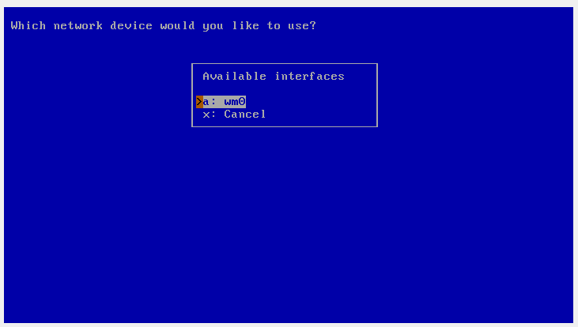
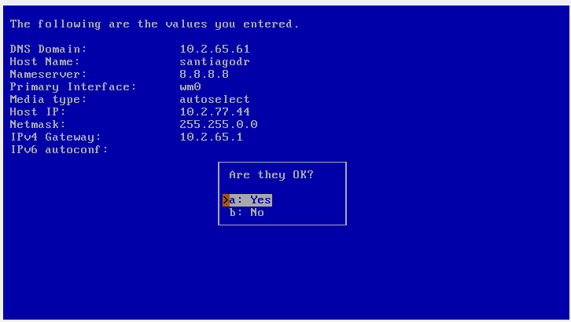

BSD# **BITÁCORA DE INSTALACIÓN NetBSD**

### Autor: Santiago Diaz Rojas 
### Escuela Colombiana de Ingeniería Julio Garavito
### ACSO
## Condiciones de Instalación  

1. ISO NetBSD.
2. Oracle vm VirtualBox-7.0.14.
3. 700 MiB de memoria.
4. 3 GiB de Disco.
5. Partición de Swap de 1.5 GiB y partición de Filesystem de 1.5 GiB.
6. Tarjeta de red en modo Bridge.

### **1. Creación de maquina virtual en** *Oracle vm VirtualBox*
1. Creación de la maquina

2. Configuración de hardware con 700 MiB de memoria.

3. Configuración de disco duro virtual con 3 GiB.

4. Revisar resumen de maquina.

### **2. Configuración de ISO de NetBSD y tarjeta de red en modo Bridge**

1. Inserción del ISO de NetBSD en la unidad óptica.

2. Configuración de tarjeta de red en modo Bridge.

### **3. Instalación mínima del sistema operativo**
1. Prender la maquina.

2. Selección de lenguaje de mensajes de instalación.
 
3. Selección de configuración de teclado.

4. Selección de sistema de instalación de NetBSD, escogemos la opción e "menu de utilidades".

5. Al entrar al menu de Utilidades,se procede a particionar el disco entrando a la opción d "particionar un disco".

6. En el administrador de particiones, se procede a particionar wd0, se elije la opción a tres veces.

7. Adicionamos la primer partición en el GPT.

8. Partición tipo SWAP, con 1.5 GiB.

9. Particion tipo FFSv2, con 1.5 GiB.

10. Revision de lista de particiones.

11. Guardado de cambios y regresamos al Sistema de instalación.
 
12. Seleccionamos la opción a de este.

13. Continuamos con la instalación.

14. Nos sale para configurar las particiones, sin embargo como ya se encuentran, lo omitimos y procedemos a tomar la instalación mínima y el medio por el cual lo vamos a realizar en este caso por medio del ISO.

### **4. Configuración de red**

1. Seleccionamos el dipositivo de red a configurar

2. eleccionamos nuestro hostname, IPv4, DNS, gateway. 
