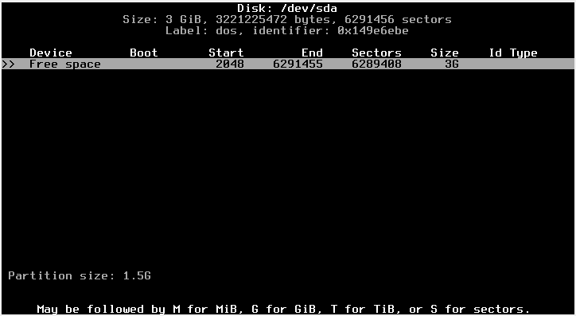
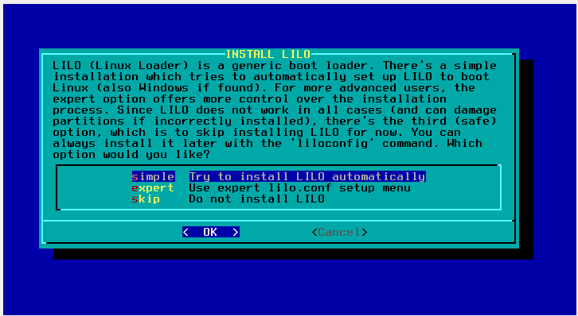
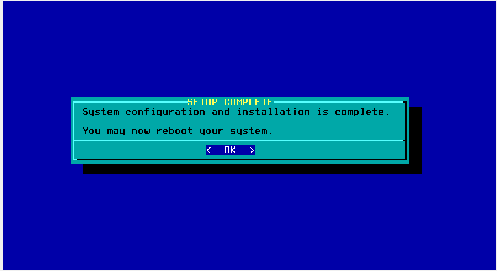

# **BITÁCORA DE INSTALACIÓN SLACKWARE 15.0**

### Autor: Santiago Diaz Rojas 
### Escuela Colombiana de Ingeniería Julio Garavito
### ACSO
## Condiciones de Instalación  

1. ISO slackware 15.0
2. Oracle vm VirtualBox-7.0.14
3. 700 MiB de memoria
4. 3 GiB de Disco
5. Partición de Linux Swap de 1.5 GiB y partición de Linux de 1.5 GiB

### **1. Creación de maquina virtual en** *Oracle vm VirtualBox*

    

1. Configuración de hardware con 700 MiB de memoria.

    

2. Configuración de disco duro virtual con 3 GiB.

    

3. Resumen de la maquina.

    

4. Visualización de la maquina en *Oracle vm VirtualBox*. 

    

### **2. Configuración de ISO de Slackware 15.0**

1. Se abre el menu de configuraciones de la maquina.

    

2. Se despliega el submenu de configuración *"Almacenamiento"*, como se puede ver en los dispositivos de almacenamiento el Controlador esta vació para configurar lo nos vamos a los atributos del mismo y en la unidad óptica colocamos la ruta de nuestro buscador de archivos donde tenemos el *"slackware-15.0-install-dvd.iso"*.

    

    

### **3. Despliegue de la maquina**

1. Para iniciar la maquina se da inicio en la parte superior de la pantalla principal de *Oracle vm VirtualBox*.

    

2. Después de leer la descripción de inicio del Kernel iniciamos el Kernel por defecto dando enter. Esto nos despliega la instalación del mismo y posteriormente la configuración del teclado de la maquina.

    

3. para configurar este mismo escribimos 1 y damos enter. se despliega un menu de opciones donde se encuentra todas las configuraciones teclado posibles, seleccionamos *"qwerty/la-latin1.map"*

    

    

4. Se hacen pruebas de que funciona las teclas del teclado se da enter para desplegar la ventana de aceptación; se acepta con 1 en caso de funcionamiento se rechaza con 2 esto hace que se despliega de nuevo el menu de opciones del teclado.

    

    

### **4. Bienvenida de Slackware Linux y particiones de disco**

    Después de la configuración del teclado se despliega la siguiente ventana:

    

1. Leyendo las instrucciones el nos permite una documentación para configurar las particiones de disco necesarias, ejecutando el comando *setup* obtenemos las siguientes instrucciones:

    

2. Estas nos dicen que para realizar particiones de disco duro, se debe utilizar el comando *"cfdisk"*, se procede a la ejecución del mismo y este nos muestra la siguiente ventana:

    

3. Nos muestra 4 tipos:

    - gpt: mas de 4 particiones, discos de gran tamaño (mayores a 2TB).
    - dos: no mas de 4 particiones, discos de tamaño menor ( menores a 2TB)
    - sdi y sun: Estas opciones están diseñadas para sistemas específicos como estaciones de trabajo SGI o Sun Microsystems.

    Se escoge el tipo *"dos"* y se despliega el siguiente menu de selección:

    

4. Se crea la primer partición primaria de disco (Linux Swap con un tamaño de 1.5GiB) el numero de tipo de la partición es el 82.

    

    

    

    

5. Se crea la segunda partición primaria de disco (Linux con un tamaño de 1.5GiB) el numero de tipo de la partición es el 83.

    

    

    

6. Volvemos al menu de particiones, escribimos los cambios en el disco de ambas particiones y lo cerramos.

    

    

7. Se ejecuta el comando *"setup"* como lo indica las instrucciones en el indice 1. Aquí tenemos acceso a la configuración de Slackware Linux.

    

8. Entramos a *"target"* para configurar la partición de Linux.

    

9. Al seleccionarla, el sistema nos pregunta que si queremos formatear la partición, como es una partición nueva no debería tener nada por lo tanto no importa si lo hacemos o no, sin embargo se procede a formatearla.

    

10. Nos muestra un menu donde podemos escoger el sistema de archivos, para este caso se escoge el *"ext4"*, pues es el que nos brinda una mayor compatibilidad, rendimiento y facilidad de uso al tratarse de un instalación mínima. Posterior mente finalizamos el proceso.

    

    

11. Se procede a seleccionar desde donde se tiene el archivo donde tenemos el sistema operativo es decir el *"slackware-15.0-install-dvd.iso"*, seleccionamos la unidad disco CD o DVD.

    

12. Nos pregunta que si queremos hacer una selección del disco automática o manual, se selecciona la opción manual.

    

13. Revisamos en que unidad óptica se encuentra para asi escoger correctamente el sistema CD/DVD. como se ve en los atributos es un dispositivo IDE secundario configurado como master. lo seleccionamos y continuamos.

    

    

14. Se despliega el menu de selección de paquetes de serie, donde se selecciona la serie A, AP, D, L, N. Los cuales son los requeridos para una instalación mínima.
*https://www.linuxquestions.org/questions/slackware-installation-40/minimal-install-for-slackware-15-0-a-4175721375/page2.html*

    

15. Seleccionamos el modo de iniciación, en este caso como experto.

    

16. Seleccionamos los paquetes de las serie A, AP, D, L, N respectivamente.

    

- Serie A: aaa_base, aaa_glibc-solibs, aaa_libraries, aaa_terminfo, acl, attr, bash, bin, bzip2, coreutils, cpio, cracklib, dbus, dcron, devs, dialog, e2fsprogs, elogind, etc, eudev, file, findutils, gawk, glibc-zoneinfo, grep, gzip, hostname, kernel-firmware, kernel-generic, kernel-huge, kernel-modules, kmod, less, libgudev, libpwquality, lilo, logrotate, mkinitrd, nvi, openssl-solibs, os-prober, pam, pkgtools, procps-ng, sed, shadow, sharutils, sysklogd, syslinux, sysvinit, sysvinit-scripts, tar, util-linux, which, xz.

- Serie AP: slackpkg.

- Serie D: perl.

- Serie L: libunistring, ncurses.

- Serie N: ca-certificates, gnupg, iproute2, iputils, libmnl, net-tools, network-scripts, ntp, openssh, openssl, wget.

17. esperamos a que se instalen los paquetes.

    

18. Le damos *"skip"* pues no lo requerimos.

    

19. Le damos *"simple"*.

    

20. Usaremos la consola estándar de Linux.

    

21. En la configuración de los parámetros que se le van a pasar al kernel, lo dejamos vació y continuamos.

    

22. Instalamos LILO(LInux LOader) en el Master Boot Record (MBR).

    

### **5. Agregación y configuración de tarjeta de red**

Agregamos tarjeta de red en modo *"Puente adaptador"*, e iniciamos la configuración.

    

    

1. Configuramos el Hostname.

    

2. Configuramos el dominio.

    

3. Negamos la conexión por VLAN.

    

4. Configuramos una IP estática.

    

5. Ingresamos la IP.

    

6. Ingresamos el Gateway.

    

7. Confirmamos la configuración de red.

    

8. Configuramos los servicios de inicio.

    

9. Configuramos el formato de hora, dando *no* y aceptando la hora local *America/Bogota*.

    

    

10. Aceptamos la configuración por defecto, pues nos beneficia el formato de codificación UTF-8.

    

11. Configuramos la contraseña del root *SantiagoDiazRojas*

    

    

12. Terminamos la configuración.

    

13. Nos redirigirá a la ventana de configuración inicial, donde daremos *"exit"*, quitamos el disco de la imagen del iso y procedemos a restablecer el sistema

    

    

14. Nos iniciara la siguiente ventana donde daremos enter y procederemos hacer las pruebas de red.

    

