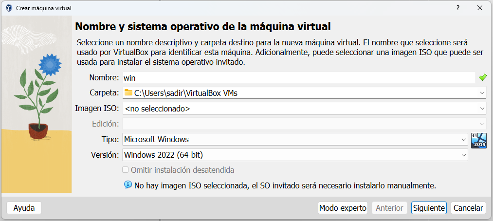

# **BITÁCORA DE INSTALACIÓN WINDOWS SERVER**

### Autor: Santiago Diaz Rojas 
### Escuela Colombiana de Ingeniería Julio Garavito
### ACSO
## Condiciones de Instalación  

1. ISO Windows Server 2022 x64
2. Oracle vm VirtualBox-7.0.14
3. 4096 MiB de memoria
4. 40 GiB de Disco

## Instalación sin Interfaz
### 1.  Creación de maquina virtual en *Oracle vm VirtualBox*

1. Creación de una nueva maquina virtual en VirtualBox, esta sera llamada win y sera de tipo Microsoft Windows versión 2022 (64-bit), en primer momento no se le definirá images/imagen ISO.

2. Se le asigna 4096 MB de memoria RAM y 40 GB de disco duro, con 2 CPUs.

3. Revisamos el resumen de configuración de la maquina.

4. Insertamos es ISO de Windows Server en la unidad de optica SATA 1.

5. Configuramos el adaptador de red en en modo Bridge.

### 2.  Despliegue maquina virtual.
1. Inicio de la maquina.

2. Seleccionamos el formato de hora y la configuración de nuestro teclado.

3. Iniciamos la instalación del sistema operativo.

4. Seleccionamos la versión estándar de Windows y aceptamos los términos y condiciones de licencia. 

5. Seleccionamos la instalación avanzada.

6. Visualizamos el espacio disponible en nuestra memoria.

7. Comienzo de la instalación.

8. Cuando se termina la instalación, procedemos a quitar el ISO de la unidad óptica y reiniciamos la maquina.

### 3.  Configuración de usuario administrador.

1. Cambio de la contraseña del administrador.

2. Despliegue del menu de configuración.

3. Configuramos la red seleccionando la opción 8, seleccionamos la tarjeta de red dsiponible.

4. configuramos la IP, la mascara y el DNS.

## Instalación con Interfaz
### 1.  Creación de maquina virtual en *Oracle vm VirtualBox*

1. Creación de una nueva maquina virtual en VirtualBox, esta sera llamada win2 y sera de tipo Microsoft Windows versión 2022 (64-bit), en primer momento no se le definirá images/imagen ISO.

2. Se le asigna 4096 MB de memoria RAM y 40 GB de disco duro, con 2 CPUs.

3. Revisamos el resumen de configuración de la maquina.

4. Insertamos es ISO de Windows Server en la unidad de optica SATA 1.

5. Configuramos el adaptador de re en en modo Bridge.

### 2.  Despliegue maquina virtual.
1. Inicio de la maquina.

2. Configuramos la hora y el teclado.

3. Comenzamos la instalación.

4. Seleccionamos la versión estándar de Windows con experiencia de escritorio y aceptamos los términos y condiciones de licencia. 

5. Seleccionamos la instalación avanzada.

6. Visualizamos el espacio disponible en nuestra memoria.

7. Comienzo de la instalación.

8. Cuando se termina la instalación, procedemos a quitar el ISO de la unidad óptica y reiniciamos la maquina.

### 3.  Configuración de usuario administrador.

1. Cambio de la contraseña del administrador.

2. Despliegue del escritorio de la maquina virtual.

3. Ingresamos a las configuraciones y procedemos a configurar la red.

4. Entramos al menu de conexiones de red.

5. Entramos a las propiedades de la misma y seleccionamos el iPv4 para configurar la IP, la mascar y el DNS.

### 4. Creación de usuarios.
1. Entramos al administrador del computador.

2. Entramos al submenu de usuarios y grupos.

3. Creamos 3 usuarios Santiago, Camila y Daniella.

### 5. Creacion de permisos

1. Vamos a configurar diferentes permisos para cada unu de los usuarios nuevos

    - A Santiago le vamos a dar control total.
    - A Daniella solo le vamos a dar permiso de lectura.
    - A Camila le vamos a dar permisos de modificacion, lectura y ejecucion.

